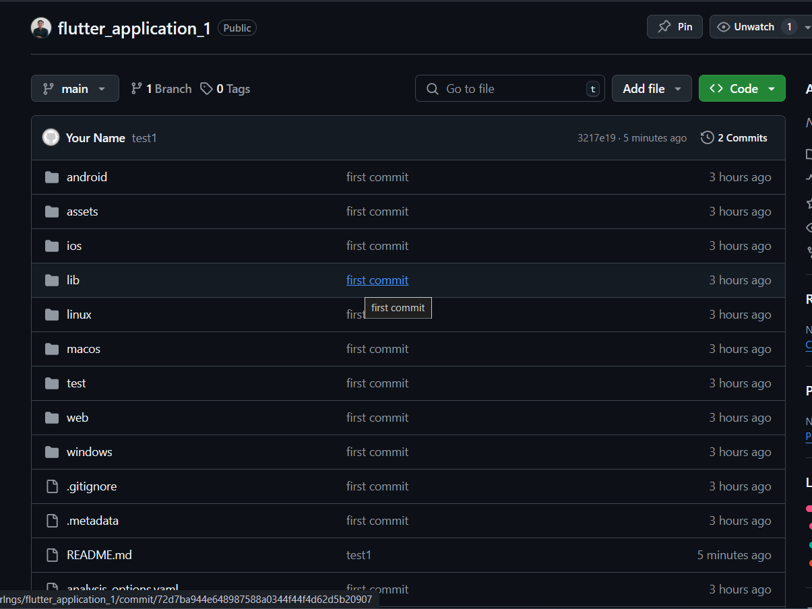
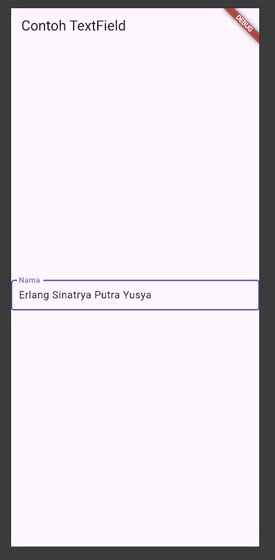

Nama    : Erlang Sinatrya Putra Yusya

NIM     : 362358302083

Kelas   : TRPL 2B

        Praktikum 1
Membuat projek flutter baru

ketika sudah membuat projek flutter baru nanti akan otomatis membuat aplikasi mobile 

        Praktikum 2
login akun git 

karena git nya sudah tidak ada yang bermasalah 
kita langsung hubungkan ke github

lalu akan muncul seperti ini

kita running projeknya

        Praktikum 3
Buat folder baru di lib, lalu kita tambahkan file image_widget.dart dan text_widget.dart

isi file text_widget.dart 

isi file image_widget.dart

sesuaikan assets pada file pubspec.yaml

buat folder baru untuk gambar

ubah dan tambahkan di file main.dart

tampilan akan seperti ini setelah di ubah dan di tambahkan widget

        Praktikum 4

Langkah 1: Cupertino Button dan Loading Bar

buat file loading_cupertino.dart

code : [text](lib/widgedComponen/loading_cupertino.dart)

tambahkan di file main.dart

hasil :

Langkah 2: Floating Action Button (FAB)

buat file fab.dart 

code : [text](lib/widgedComponen/fab.dart)

hasil :

Langkah 3: Scaffold Widget 

buat file scafold_widget.dart

code : [text](lib/widgedComponen/scafold_widget.dart)

Scaffold widget digunakan untuk mengatur tata letak sesuai dengan material design.

Langkah 4: Dialog Widget

code : [text](lib/widgedComponen/dialog_widget.dart)

Dialog widget pada flutter memiliki dua jenis dialog yaitu AlertDialog dan SimpleDialog.

Langkah 5: Input dan Selection Widget

code : [text](lib/widgedComponen/input_widget.dart)

Flutter menyediakan widget yang dapat menerima input dari pengguna aplikasi yaitu antara lain Checkbox, Date and Time Pickers, Radio Button, Slider, Switch, TextField.

hasil :

Langkah 6: Date and Time Pickers

code : [text](lib/widgedComponen/date_widget.dart)

hasil :

